# WL Farming V2 [FR/EN]

## Introduction

Le bot offre une variété de fonctionnalités pour améliorer l'interaction et l'engagement sur votre serveur Discord. 
Un système de boutons et de menus a été mis en place pour rendre l'utilisation du bot aussi simple que possible.

## Description

WL Farming V2 est un bot de divertissement qui vous permet de gérer une culture virtuelle et de gagner des $WL en cultivant et en vendant vos récoltes.
Vous pouvez acheter des graines, planter les graines dans les 4 parcelles de votre plantation, et les récolter lorsqu'elles sont prêtes. 
Vous pouvez également vendre vos plantes pour gagner de l'argent que vous pouvez dépenser dans la boutique pour acheter de nouveaux outils et de nouvelles graines.

## Fonctionnalités

- Plantation et récolte : Vous pouvez planter des graines dans les parcelles de votre plantation et les récolter lorsqu'elles sont prêtes.
- Vente de plantes : Vous pouvez vendre vos plantes au marchand pour gagner de l'argent.
- Achat d'objets : Vous pouvez acheter des graines, des outils et de l'engrai avec l'argent que vous gagnez.
- Inventaire : Consultez votre inventaire, qui comprend l'argent, les graines, les plantes et les outils.
- Classement : Un classement des 10 utilisateurs les plus riches.
- Language : Choissisez la langue d'affichage de votre jeu (FR/EN).
  
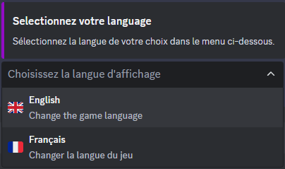

## Backup des données

- Une sauvegarde des données utilisateur est éffectuée toutes les heures, un fichier .zip est créé dans le dossier "backups", nommé au format de date `JJ-MM-AAAA_-_HH-MM`.
  
- Attention ! selon la capacité de votre hébergement il est préférable de supprimer les backups les plus anciens fréquemment (*Gardez les 10 derniers*).


## Commandes de jeu <permission: utilisateur>

### `/sos`

- Affiche la liste de toutes les commandes disponibles.


### `/ranking`

- Affiche le classement des 10 utilisateurs les plus riches.

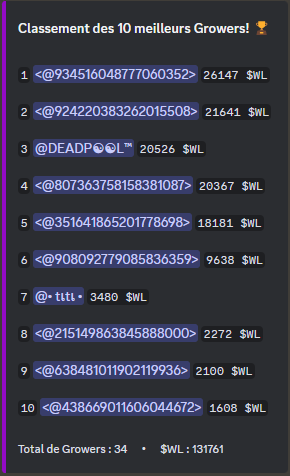

### `/start`

- Crée votre plantation et vous inscrit dans la base de données.

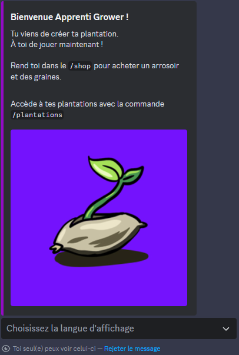

### `/plantations`

- Permet d'interagir sur les différentes parcelles (*Slot 1, Slot 2, Slot 3, Slot 4*)
  grâce aux boutons (*Planter, Arroser, Récolter, Fertiliser, Anti-parasite*).


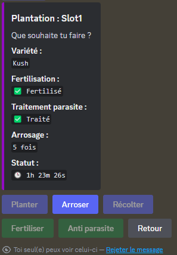
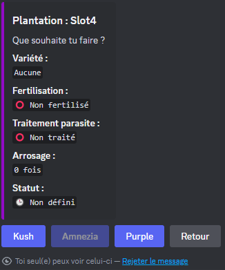


### `/inventory` <1 option>

- Consultez votre inventaire ou celui d'un autre utilisateur.

Option : 

- `choix de l'utilisateur`


### `/sell`

- Vendez vos plantes au marchand.

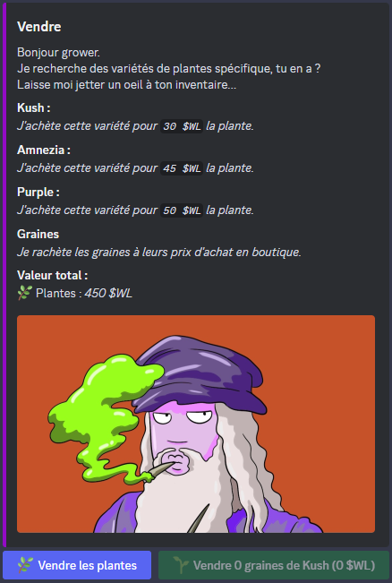

### `/shop`

- Affiche la boutique pour y acheter divers objets (*Arrosoir, Graine, Fertilisant et Produit anti-parasite*).

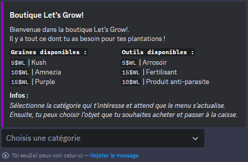


## Commandes de gestion <permission: administrateur>

### `/money` <2 options>

- Permet de créditer/débiter un utilisateur.

Options : 

- `choix de l'utilisateur` 
- `choix du montant (valeur négative pour débité l'utilisateur, 50 = crédite 50 $WL | -50 = débite 50 $WL)`


### `/objet` <5 options>

- Permet d'ajouter/supprimer un objet à un utilisateur.

Options : 

- `choix de l'utilisateur`
- `catégorie (graine, plante, outils)`
- `objet (kush, amnezia, purple, arrosoir, fertilisant, produit_antiparasite)`
- `quantité (valeur négative pour retiré l'objet de l'inventaire de l'utilisateur)` 
- `débit (si activé, l'utilisateur sera débité de la valeur de l'objet multiplié par la quantitée)`


## Fonctionnement 

L'utilisateur possède 4 parcelles (slots) dans sa plantation.
Il peut acheter divers types de graines qui ont des niveaux de difficulté différentes.
Le niveau de difficulté se traduit par le nombre d'arrosages nécessaires.
Les variétés difficiles sont plus exigeantes et la marge d'erreur est quasi nulle, contrairement aux variétés faciles.
Un nombre d'arrosages à 0 ou supérieur à 9 tuera la plante.

Les plantes selon leurs variétées ont des temps de coissance différentes.
Des attaques de parasites peuvent détruire la plante ou réduire son niveau de qualité pendant sa croissance.
Traiter sa parcelle contre les parasites évite ces attaques mais a 90% de chance de diminuer son niveau de qualité de 1.
Une parcelle non traité contre les parasites a 70% de chance de subir une attaque.
Lorsqu'une parcelle subit une attaque parasitaire la plante à 40% de chance de mourir et 60% de chance de diminuer son niveau de qualité de 1.

L'utilisateur peut fertiliser ses plantes pour augmenter leur niveau de qualité de 1.

L'arrosoir est un objet définitif, un seul arrosoir suffit pour une infinité d'arrosages.


```
Il existe 5 niveaux de récolte :

- Niveau 0 : L'utilisateur ne récolte pas la plante (aucun bonus).
- Niveau 1 : L'utilisateur récolte la plante (aucun bonus).
- Niveau 2 : L'utilisateur récolte la plante (bonus : 1 chance sur 2 d'obtenir 1 graine).
- Niveau 3 : L'utilisateur récolte la plante (bonus : 1 chance sur 2 d'obtenir 2 graines).
- Niveau 4 : L'utilisateur récolte la plante (bonus : 1 chance sur 2 de doubler la récolte ou d'obtenir 4 graines).
```
## Détail technique 

### Les boutons

Pour éviter les bugs/glitches et les utilisations mal intentionnées, certains boutons sont désactivés lorsque l'utilisateur ne remplit pas certaines conditions,
par exemple, après avoir cliqué sur le bouton "planter", de nouveaux boutons apparaissent (1 bouton pour chaque variété de graine disponible dans le jeu).
Si l'utilisateur ne possède pas un type de graine, le bouton associé sera désactivé.
Lorsqu'une parcelle est fertilisée ou si l'utilisateur ne possède pas de fertilisant, le bouton "Fertiliser" est désactivé.
Lorsqu'une parcelle est traitée contre les parasites ou si l'utilisateur ne possède pas de produit anti parasite, le bouton "Anti parasite" est désactivé.
Tant que la parcelle n'est pas prête à être récoltée, le bouton "Récolter" est désactivé.
Tant que la parcelle n'est pas libre, le bouton "Planter" est désactivé.
Lorsqu'un utilisateur récolte ou plante, le bouton "Retour" sera désactiver le temps que la sauvegarde s'effectue.

### Les commandes

Des vérifications sont effectuées à chaque fois qu'un utilisateur exécute une commande.
Ces vérifications s'assurent que l'utilisateur est enregistré dans la base de données et qu'il possède les permissions pour effectuer la commande.
Si l'utilisateur n'est pas enregistré, il ne pourra pas accéder à la boutique, au marchand, à ses plantations et à son inventaire.

## Structure des données

Les données sont stockées de manière à optimiser au maximum les interactions entre le bot et les utilisateurs.
Chaque utilisateur a sa propre sauvegarde et est identifié par son ID Discord (unique et non modifiable).
Les objets du jeu sont stockés dans un fichier "database" qui contient toutes les informations nécessaires au bon fonctionnement du bot.

### Utilisateurs
Chaque utilisateur est représenté par un objet JSON qui contient les propriétés suivantes :

- `id` : ID Discord de l'utilisateur.
- `nomServeur` : Nom global de l'utilisateur.
- `nom` : Nom d'utilisateur Discord.
- `lang` : La langue choisi par l'utilisateur.
- `inventaire` : Inventaire de l'utilisateur.
- `plantations` : Plantations de l'utilisateur.

L'objet `inventaire` contient les propriétés suivantes :

- `money` : La quantité d'argent que l'utilisateur possède.
- `graines` : Les graines que l'utilisateur possède.
- `plantes` : Les plantes que l'utilisateur possède.
- `outils` : Les outils que l'utilisateur possède.

L'objet `plantations` contient les propriétés suivantes :

- `slot1` : les informations concernant la parcelle 1.
- `slot2` : les informations concernant la parcelle 2.
- `slot3` : les informations concernant la parcelle 3.
- `slot4` : les informations concernant la parcelle 4.

### Objets
Les objets du jeu sont représentés par un objet JSON qui stocke les informations propres à chaque objet, tels que les graines, les plantes, les outils et leurs prix, valeur de revente, descriptions et exigences.

- `graine` : Les objets de type '*graine*' ont les propriétés suivantes : prix, description et exigence (*0 = facile, 1 = normal, 2 = difficile*).
- `plante` : Les objets de type '*plante*' ont les propriétés suivantes : valeur de revente, description.
- `outils` : Les objets de type '*outils*' ont les propriétés suivantes : prix, description.

## Fichier de configuration
Certains paramètres ont été stocké dans un fichier de configuration "config.json" afin de faciliter certaines modifications.

Ce fichier contient :

- `botId` : L'ID Discord du bot.
- `botColor` : Le code couleur des messages stylisé par le bot.
- `devise` : La devise de l'argent du jeu.
- `defaultLang` : La langue par défaut du jeu (en/fr).
- `farmingChannel` : L'ID du salon dans lequel les messages public sont envoyée.
- `startMoney` : Le montant d'argent avec lequel l'utilisateur commence.
- `devMode` : Activer ou désactiver le mode maintenance (Les utilisateur ne peuvent plus utilisé le bot en mode maintenance).
- `devID` : L'ID du developpeur qui pourra utiliser le bot lorsque le mode maintenance est activé.


## Contribution
Si vous souhaitez contribuer à ce projet, veuillez contacter Thierry Breure à cette adresse mail : `thierry.breure@gmail.com`

## Licence
Ce projet n'est pas sous licence.

## Installation

1. Connectez-vous sur le site [discord.com/developers](https://discord.com/developers/applications) avec votre compte Discord.
2. Créez une nouvelle application.
3. Dans la section "Bot" cochez les paramètres suivants : Public Bot | Presence Intent | Server Members Intent | Message Content Intent et sauvegardez.

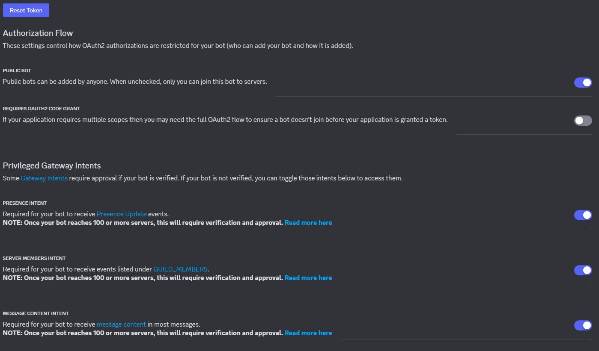

4. Dans la section "OAuth2" cochez la cases "bot" dans la rubrique SCOPES.

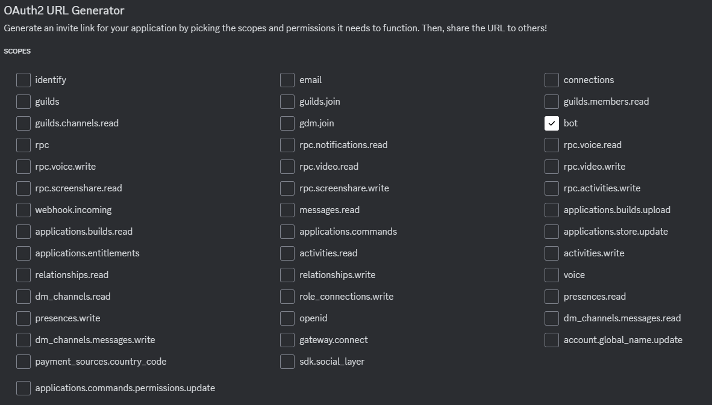

5. Dans la section "OAuth2" cochez la cases "Administrateur" dans la rubrique BOT PERMISSIONS.

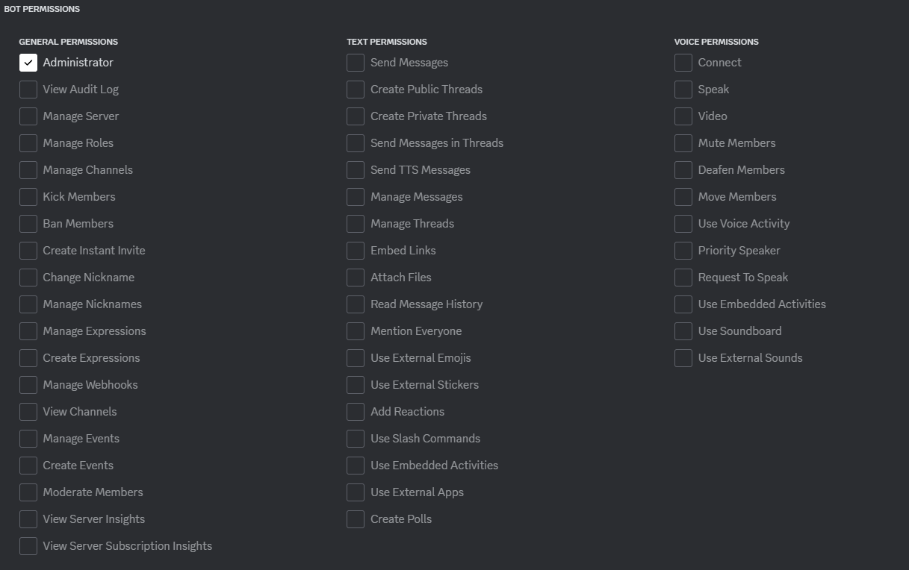

6. Copier le lien généré en bas de la page (c'est le lien d'invitation du bot).


7. Collez ce lien dans votre navigateur et invitez le bot sur le serveur Discord de votre choix.

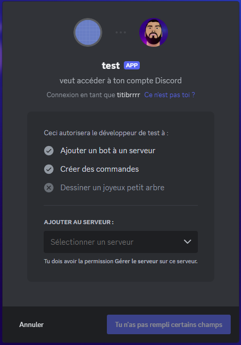

## Configuration du token, clientId et guildId dans les fichiers du bot :

### Fichier .env

Récupérez le fichier .env à compléter dans le dossier compressé "fichier env.rar"


- `token` le token de l'application Discord à récupérer sur le [Portail Dev Discord](https://discord.com/developers/applications) (*section Bot*).
- `clientId` l'identifiant Discord du bot à récupérer sur le [Portail Dev Discord](https://discord.com/developers/applications) (*section General Information sous l'intitulé "Application ID"*) ou directement sur le profil du bot sur Discord via l'option mode développeur (*Paramètre - Avancés - Mode développeur*).
- `guildId` l'identifiant du serveur Discord sur lequel le bot sera utilisé.

### Fichier config.json


- `botId`  l'identifiant Discord du bot (**identique au cliendId du fichier .env**).
- `farmingChannel` c'est l'identifiant du salon dans lequel le bot enverra les messages public.
- `devMode` true = mode maintenance activé (*Bot utilisable uniquement par "devID"*).
- `devID` identifiant de l'utilisateur qui s'occupe de l'aspect technique du bot ou le propriétaire.

### Dépendance NPM

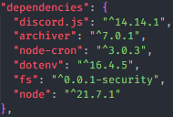

- `discord.js` 
- `archiver`
- `node-cron`
- `dotenv`
- `fs`
- `node`

Pour que le bot fonctionne, l'installation de ces dépendances est **OBLIGATOIRE !**
La commande `npm install` s'occupera d'installer les dépendances listé dans le fichier package.json (*à faire dans le terminal ou la console*)

### Fichier database.json dans le dossier database

Le fichier **database.json** stock toutes les informations nécessaire au bon fonctionnement du bot (*graine, plante, outils, parasites*), les prix, valeurs et autres infos.
C'est dans ce fichier que les temps de croissance peuvent être modifier dans la section ["graine" -> "kush" -> "temps"] (*la valeur est en minutes, donc pour paramétrer un temps de croissance à 1 heure : ajuster la valeur à 60*)
Modifiez les prix, les valeurs et les temps selon vos préférences.

### Démarrage du bot

1. Dans le terminal ou la console tapez la commande `node deploy-commands.js` afin de déployer les commandes du bot sur Discord.
2. Toujours dans le terminal ou la console tapez la commande `node index.js` afin de démarrer le bot.
3. Enjoy 😉 le bot est connecté !


## Maintenance et bug connu ⚠️

Un bug vide le fichier de sauvegarde d'un utilisateur, ce qui l'empèche d'utiliser le bot et lui fait perdre sa progression.
Un système de backup a donc été mis en place afin de limité la casse, une sauvegarde est éffectuée dans le dossier "backups" toutes les heures.
Le dossier est compressé en .zip et nommé au format de date JJ-MM-AAAA_-_HH-MM.
Il est primordial de nettoyer les backups lorsqu'ils s'accumulent trop, je recommande de conserver les 10/20 derniers backups.
Cela permet de récupérer une sauvegarde récente d'un utilisateur qui subirai ce bug.
A ce jour, aucun correctif n'a été appliqué à ce problème, libre à vous d'y jeter un œil, d'après moi cela pourrais venir de la fonction saveDb() dans le fichier "fonctions.js".
